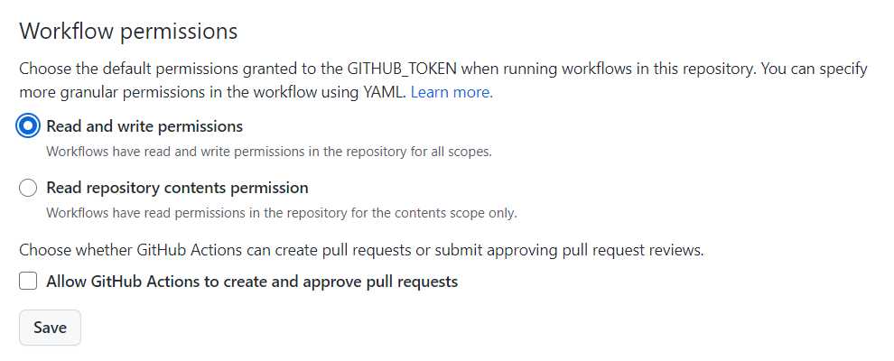

# GitHub Actions Workflow Demo

This repository contains some demos around [GitHub Actions](https://docs.github.com/en/actions), and references to other repos where I'm running [Codespaces](https://github.com/features/codespaces) and/or [Co-Pilot](https://github.com/features/copilot) that can also be used as great demo resources. Each section below holds more information on the concrete demo.

<details>
<summary><h2>Dependabot demo</h2></summary>

### How to activate

settings -> security and analysis -> enable version updates

### How to add dependabot

To get started with Dependabot version updates, you'll need to specify which  package ecosystems to update and where the package manifests are located.  Please see the documentation for all configuration options:
https://docs.github.com/github/administering-a-repository/configuration-options-for-dependency-updates

```
version: 2
updates:
  - package-ecosystem: "github actions" # See documentation for possible values
    directory: "/" # Location of package manifests
    schedule:
      interval: "weekly"
```

</details>

<!--
<details>
<summary><h2>Codespaces demo</h2></summary>


we are going to use my personal demo repository 
https://github.com/jetzlstorfer/plattentests-go

1. go build
2. make run 
3. make run-function

</details>

<details>
<summary><h2>Co-pilot demo</h2></summary>

https://github.com/jetzlstorfer/plattentests-go 

in golang

e.g. adding functions to calculate prime numbers or to print text in a specific color

</details>
-->

<details>
<summary><h2>GitHub Actions demo</h2></summary>

The idea of the workflow with GitHub Actions is to automatically add a new entry to the list below when someone stars the repo.

The workflow file can be found in `.github/workflows/ratings.yml`. 



</details>

## 💡 How the GitHub Actions demo works 

### Action: Star the repo ⭐ and your name will show up in the list below.

**People that liked the session 🥳**


❤️ User [@flomader](https://github.com/flomader) liked the session and rated the repo with a star ⭐

❤️ User [@DistEntArch](https://github.com/DistEntArch) liked the session and rated the repo with a star ⭐

❤️ User [@insolitum](https://github.com/insolitum) liked the session and rated the repo with a star ⭐

❤️ User [@JesusGautamah](https://github.com/JesusGautamah) liked the session and rated the repo with a star ⭐

❤️ User [@PP-Namias](https://github.com/PP-Namias) liked the session and rated the repo with a star ⭐

❤️ User [@scrumtuous](https://github.com/scrumtuous) liked the session and rated the repo with a star ⭐

❤️ User [@ArminPrieschl](https://github.com/ArminPrieschl) liked the session and rated the repo with a star ⭐
